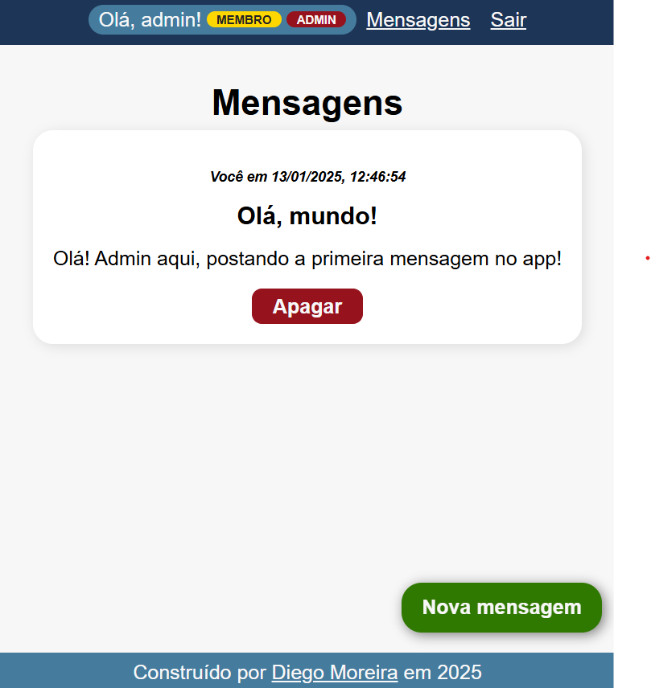

# Apenas Membros

Este é um projeto de um app de mensagens [The Odin Project](https://www.theodinproject.com/) para fixar o aprendizado sobre autenticação em aplicações NodeJS. Um exemplo do projeto está online em: [odin-members-only.glitch.me](https://odin-members-only.glitch.me/).



No app, visitantes podem visualizar as mensagens enviadas pelos usuários. Ao criar uma conta, o usuário consegue enviar mensagens. E ao conseguir se tornar um membro, o usuário pode ver por quem e quando as mensagens foram enviadas. É possível se tornar membro fornecendo uma senha, definida no arquivo `.env`. Apenas os autores e administradores podem apagar mensagens. Administradores são definidos manualmente no banco de dados.

## Tecnologias Utilizadas

- Node.js
- Express.js
- PostgreSQL
- EJS
- Sass
- Passport (local)
- Bcrypt

## Como Executar

1. **Clone o repositório:**

```bash
git clone https://github.com/Diego-Moreira8/odin-members-only.git
```

2. **Instale as dependências:**

```bash
cd odin-members-only
npm install
```

3. **Configure o banco de dados:**

- Certifique-se que o PostgreSQL está instalado e em execução.
- Crie o banco de dados `odin_members_only`.
- Crie um arquivo .env na raiz do projeto com o URI de conexão da base de dados. O arquivo **.env.example** possui todas as variáveis necessárias para a execução da aplicação. Personalize-o para o seu ambiente.
- Execute o script para criação das tabelas e usuário _admin_:

_**Atenção:** este script apaga tabelas existentes! Execute-o sempre que precisar reiniciar as tabelas._

```bash
npm run reset-db
```

4. **Execute o aplicativo:**

```bash
npm run dev
```

Isso iniciará um servidor de desenvolvimento local.

---

_**Nota:** Este projeto é apenas para fins educacionais e de aprendizado. Não é recomendado para uso em produção sem considerar práticas de segurança adequadas._
